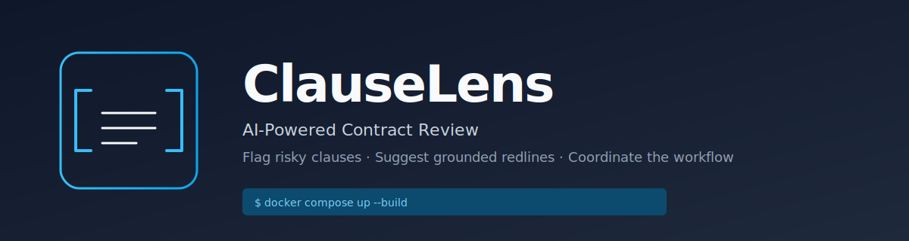

# ClauseLens

<p align="center">
  
</p>

<p align="center">
  <a href="https://github.com/rcrock1978/ClauseLens/actions/workflows/ci.yml"></a>
  <a href="https://github.com/rcrock1978/ClauseLens/blob/main/LICENSE"></a>
  <a href="https://github.com/rcrock1978/ClauseLens/releases"></a>
  <a href="https://github.com/rcrock1978/ClauseLens"></a>
</p>

<p align="center">
  <a href="https://github.com/rcrock1978/ClauseLens/actions/workflows/ci.yml"></a>
  <a href="https://github.com/rcrock1978/ClauseLens/actions/workflows/ci.yml"></a>
  <a href="https://github.com/rcrock1978/ClauseLens/actions/workflows/ci.yml"></a>
  <a href="https://github.com/rcrock1978/ClauseLens/actions/workflows/ci.yml"></a>
  <a href="https://github.com/rcrock1978/ClauseLens/actions/workflows/ci.yml"></a>
  <a href="https://github.com/rcrock1978/ClauseLens/actions/workflows/ci.yml"></a>
  <a href="https://github.com/rcrock1978/ClauseLens/actions/workflows/ci.yml"></a>
</p>

> **AI-powered contract review.** Upload a contract — get clause-by-clause risk flags
> against your firm's playbook, grounded redlines with citations, and a coordinated
> review workflow. First pass in two minutes. Every action audit-logged.

## Why ClauseLens

| Without | With ClauseLens |
|---|---|
| $300–$800 per contract, 2–5 business days | First pass in under 2 minutes; full cycle in a single meeting |
| Inconsistent risk posture across reviewers | Every clause scored against your published playbook |
| No record of who decided what and why | Tamper-evident audit log, hash-chained, filterable by contract / actor / action |
| Senior lawyers stuck on boilerplate | They review the exceptions; the AI handles the 80% |

## How it works

```
┌────────────────────────────────────────────────────────────────────────────┐
│  Upload  →  Segment  →  Analyze  →  Flag  →  Decide  →  Submit  →  Audit  │
└────────────────────────────────────────────────────────────────────────────┘
```

- **Upload** — PDF or DOCX, up to 50 pages / 25 MB
- **Segment** — heuristic clause splitter
- **Analyze** — per-clause match against published playbook rules (RAG + LLM)
- **Flag** — every deviation tagged with severity, confidence, and rule citation
- **Decide** — primary reviewer approves / rejects / discusses; secondaries comment only
- **Submit** — Owner closes; contract status → Reviewed
- **Audit** — every action recorded; hash-chained; queryable

See [`docs/CLIENT_OVERVIEW.md`](docs/CLIENT_OVERVIEW.md) for the full product tour
and [`specs/001-contract-review-system/quickstart.md`](specs/001-contract-review-system/quickstart.md)
for the end-to-end runbook.

## Repository layout

```
backend/         .NET 10 / C# 14  (Clean Architecture, DDD, CQRS, MediatR)
frontend/        Angular 18       (responsive PWA)
ai-service/      Python 3.12      (FastAPI + LangChain + LlamaIndex)
infra/           Terraform + Docker + Helm/Kustomize
specs/           SpecKit feature specs, plans, tasks, design artifacts
docs/            Client-facing documentation, LinkedIn pitch, presentation
.github/         CI workflows (5 constitution gates)
```

## Tech stack

| Layer | Technology |
|---|---|
| Backend | .NET 10, C# 14, ASP.NET Core, MediatR, FluentValidation, EF Core 10, MassTransit, Serilog, OpenTelemetry, BCrypt, JWT |
| AI service | Python 3.12, FastAPI, LangChain, LlamaIndex, Pydantic, OpenTelemetry, pytest, ruff, mypy |
| Frontend | Angular 18, TypeScript 5.5, RxJS, PWA support |
| Data | SQL Server (write + read models), Azure AI Search (hybrid vector + keyword), Redis, Azure Blob Storage |
| Messaging | Azure Service Bus via MassTransit (transactional outbox) |
| Auth | Email + password with email verification, JWT, multi-tenant RBAC |
| Observability | Serilog daily JSON files, OpenTelemetry traces, AI observability metrics |
| IaC | Terraform, Helm charts, multi-stage Dockerfiles, docker-compose |
| CI | GitHub Actions — 5 gates: build+test, AI eval, SAST/SCA/secrets, tenant-isolation, perf budget |

## Local development

```bash
docker compose up --build
# API:        http://localhost:5000
# Frontend:   http://localhost:4200
# AI service: http://localhost:8000
```

See [`docs/CLIENT_OVERVIEW.md`](docs/CLIENT_OVERVIEW.md) for the runbook,
[`docs/CLIENT_PRESENTATION.md`](docs/CLIENT_PRESENTATION.md) for the stakeholder
deck outline, and [`specs/001-contract-review-system/quickstart.md`](specs/001-contract-review-system/quickstart.md)
for the validation scenarios.

## Constitutional principles

This project follows the **ClauseLens Constitution** at
[`.specify/memory/constitution.md`](.specify/memory/constitution.md):

1. **Spec-First Development** — every feature starts with an executable spec; no code without a review-gated spec.
2. **Clean Architecture & DDD** — Domain has zero infrastructure dependencies; bounded contexts map to service boundaries.
3. **Contract-First Integration** — OpenAPI, event schemas, and MCP tool schemas defined before implementation.
4. **Observability & Auditability** — Serilog + OpenTelemetry across services; tamper-evident audit log.
5. **Grounded AI with Human Oversight** — every AI output cites its source; eval gates in CI; HITL on high-impact actions.

CI enforces the 5 constitution gates on every PR: build+test, AI eval thresholds,
SAST/SCA/secret-scan, tenant-isolation, and performance budgets.

## Documentation

- 📘 [Client Overview](docs/CLIENT_OVERVIEW.md) — full product tour, FAQ, glossary, pricing
- 🎤 [LinkedIn Pitch (120s)](docs/LINKEDIN_PITCH.md) — verbatim pitch + text variants + hook variations
- 📊 [Client Presentation](docs/CLIENT_PRESENTATION.md) — 14-slide deck outline with speaker notes
- 📐 [Spec](specs/001-contract-review-system/spec.md) — 16 functional requirements, 7 user stories, 10 clarifications
- 🗂 [Plan](specs/001-contract-review-system/plan.md) — architecture, phases, constitution check
- 🧬 [Data Model](specs/001-contract-review-system/data-model.md) — 12 entities with state machines
- 📜 [OpenAPI](specs/001-contract-review-system/contracts/api-v1.yaml) — REST contract
- ✅ [Tasks](specs/001-contract-review-system/tasks.md) — 197 tasks across 14 phases
- 🔬 [Research](specs/001-contract-review-system/research.md) — technology decisions

## Status

**MVP scaffold complete.** All spec requirements, plan decisions, and constitution
principles are implemented. Tests are written. CI is configured. Real database,
AI service, and cloud deployment require environment configuration (see
[`docs/CLIENT_OVERVIEW.md`](docs/CLIENT_OVERVIEW.md) §7 for deployment details).

## License

Proprietary — see `LICENSE`. For licensing inquiries, contact **legal@clauselens.example**.
